# AgentGuard

AgentGuard is a persistent AI control plane for repositories built by humans and coding agents. It watches every push, reads the actual patch, remembers how the codebase fits together, and decides whether a change should pass, be corrected automatically, or be stopped before it reaches production.

Unlike conventional CI, AgentGuard does not restart from zero for every commit. It maintains a living dependency graph of files, functions, classes, imports and calls; identifies only the nodes affected by a change; and gives its models the smallest useful context. The result is a new kind of repository guardian: diff-first, graph-aware, cost-conscious and capable of taking safe action.

**TypeScript · Probot · Next.js · Redis · BullMQ · PostgreSQL · Tree-sitter · Docker · Groq · Gemini**

## Table of Contents

- [Product Overview](#product-overview)
- [Why AgentGuard Is Different](#why-agentguard-is-different)
- [User Workspaces](#user-workspaces)
- [Architecture](#architecture)
- [Complete Protection Workflow](#complete-protection-workflow)
- [Dependency-Graph Workflow](#dependency-graph-workflow)
- [Features](#features)
- [Technology Stack](#technology-stack)
- [Repository Structure](#repository-structure)
- [Local Requirements](#local-requirements)
- [Quick Start](#quick-start)
- [Manual Setup](#manual-setup)
- [Environment Variables](#environment-variables)
- [GitHub App Setup](#github-app-setup)
- [API Surface](#api-surface)
- [Testing](#testing)
- [Security and Data Controls](#security-and-data-controls)
- [Operational Notes](#operational-notes)
- [Scope](#scope)

## Product Overview

AgentGuard gives agent-heavy engineering teams one continuous safety layer across their repositories:

- receive signed GitHub App events for pushes, pull requests and check reruns;
- acknowledge webhooks quickly and move analysis into a durable BullMQ queue;
- serialize mutations with a distributed per-repository lock;
- retrieve and judge the actual diff instead of trusting commit messages;
- scan patches for credentials before any model is called;
- distinguish style-only changes from logic changes with Tree-sitter;
- correct safe formatting changes inside an isolated Docker sandbox;
- route uncertain changes through cheap and reasoning model tiers;
- require every model to return schema-validated JSON;
- block dangerous commits through GitHub Checks;
- rotate compromised credentials through an OIDC-authenticated endpoint;
- roll an unprotected branch back to its last known-safe commit when enabled;
- notify operators through Discord without spamming routine changes;
- explain blocked work in plain developer language using real commit history;
- preserve incidents, notification delivery and resolution state;
- learn the codebase as a persistent dependency graph;
- send only changed graph nodes and their direct dependants to the models;
- show repository health, activity, incidents, cost and graph impact in one dashboard.

## Why AgentGuard Is Different

Most code-review automation is stateless: receive a commit, rebuild broad context, run the same checks, discard everything, repeat. That model becomes slow and expensive when many coding agents push changes concurrently.

AgentGuard treats repository understanding as durable infrastructure.

1. **It remembers.** Repository state, prior verdicts, safe commit history and graph structure survive between pushes.
2. **It reasons locally.** A changed function dirties itself and its direct callers or importers—not the entire codebase.
3. **It spends intelligently.** Static analysis handles obvious cases, a cheap model handles ordinary logic changes, and deeper reasoning is reserved for uncertainty.
4. **It acts within risk boundaries.** Style can be corrected automatically; logic is never silently rewritten.
5. **It explains every consequential decision.** Structured verdicts, real diffs, dependency diagrams and incident history remain inspectable.

This makes AgentGuard more than another CI job. It is a long-lived operational agent designed for the emerging reality of repositories receiving dozens of machine-generated changes per hour.

## User Workspaces

### Engineering workspace

Developers can:

- inspect every analyzed commit and its final decision;
- see which analysis tier handled the change;
- review latency, model tokens and graph-context size;
- open the structured cheap-tier and reasoning-tier verdicts;
- inspect the actual diff attached to an incident;
- see which functions and files were affected;
- follow a one-click explanation of a blocked change;
- rerun analysis through GitHub Checks.

### Security and operations workspace

Operators can:

- monitor repository health and active protection;
- review blocked commits and detected credentials;
- track Discord notification delivery;
- mark incidents resolved without losing their audit history;
- inspect credential-rotation and remediation outcomes;
- compare recent token cost per push;
- see which repositories are installed and protected.

### Repository-owner workspace

Repository owners can:

- install AgentGuard through the standard GitHub App flow;
- select repositories without distributing personal access tokens;
- preserve branch-protection rules during automatic corrections;
- use corrective pull requests on protected branches;
- rebuild repository graph state through the recovery API;
- control rollback and provider integrations through environment policy.

## Architecture

```mermaid
flowchart LR
    GitHub[GitHub App events] --> Webhook[Probot webhook boundary]
    Webhook --> Queue[BullMQ]
    Queue --> Lock[Per-repository Redis lock]
    Lock --> Diff[Actual GitHub diff]
    Diff --> Scan[Docker secret scan]
    Scan --> AST[Tree-sitter classification]
    AST --> Graph[(PostgreSQL code graph)]
    Graph --> Context[Dirty subgraph context]
    Context --> Cheap[Groq risk tier]
    Cheap --> Reasoning[Gemini reasoning tier]
    AST --> Correction[Safe correction sandbox]
    Reasoning --> Checks[GitHub Checks and comments]
    Scan --> Remediation[OIDC rotation and rollback]
    Checks --> Incidents[(Redis repository state)]
    Remediation --> Incidents
    Incidents --> Notify[Discord notification]
    Incidents --> Dashboard[Next.js operations dashboard]
```



## Complete Protection Workflow

1. GitHub signs and delivers a push, pull-request or check-rerun event.
2. Probot verifies the webhook signature and queues the repository job.
3. A BullMQ worker acquires the Redis lock for that repository.
4. AgentGuard retrieves the actual patch from the GitHub API.
5. Changed JavaScript and TypeScript sources update the persistent code graph.
6. The patch enters the disposable secret-scanning sandbox.
7. A detected credential immediately creates a failing check and incident.
8. Otherwise, Tree-sitter classifies the patch as style-only or logic-changing.
9. Style-only work enters the safe correction path without spending model tokens.
10. Logic changes receive bounded graph context and a schema-constrained Groq verdict.
11. Safe changes pass; uncertain or dangerous changes escalate to Gemini.
12. The final structured verdict updates GitHub Checks and repository memory.
13. Blocked changes produce an incident, notification, explanation link and graph-derived Mermaid diagram.
14. The repository health score, activity feed and efficiency history update.
15. The lock is released so the next repository event can proceed.

## Dependency-Graph Workflow

1. GitHub App installation provisions repository state automatically.
2. AgentGuard fetches the repository tree and source blobs.
3. Tree-sitter creates nodes for files, functions, methods and classes.
4. Import and direct-call relationships become persisted graph edges.
5. A new push fetches only the source files changed at that revision.
6. Added, edited and deleted nodes are applied as graph deltas.
7. Touched nodes become dirty and propagate one hop to direct dependants.
8. Duplicate full-file content is removed when symbol-level context exists.
9. Context is bounded before it enters either model tier.
10. The latest impacted nodes remain highlighted in the interactive dashboard graph.
11. Graph-derived Mermaid diagrams are attached to blocked-change comments.
12. A recovery endpoint can rebuild the graph from the repository source of truth.

## Features

### Repository protection

- Signed GitHub App webhook ingestion.
- Push, pull-request and check-rerun processing.
- Idempotent queue job identifiers.
- Distributed per-repository mutation locks.
- Actual-patch retrieval through installation tokens.
- GitHub Check success and failure reporting.
- Commit comments with technical context and diagrams.

### Tiered intelligence

- Zero-token secret and syntax gates.
- Tree-sitter style-versus-logic classification.
- Groq first-pass risk analysis.
- Gemini final reasoning and human explanation.
- Zod-validated fixed response schemas.
- Prompt-injection defence that treats code as inert data.
- Daily token accounting and per-push usage history.

### Safe correction and remediation

- Prettier corrections inside an ephemeral Docker container.
- Direct corrective commits on unprotected branches.
- Reviewable correction pull requests on protected branches.
- Optional last-known-safe branch rollback.
- OIDC bearer-token credential rotation endpoint.
- Failing checks before notification or remediation work continues.

### Persistent repository intelligence

- PostgreSQL-backed graph persistence.
- File, function, method and class nodes.
- Import and direct-call edges.
- Forward and reverse adjacency indexes.
- Changed-file graph deltas and deletion cleanup.
- One-hop dirty propagation to callers and importers.
- Bounded symbol-level model context.
- Source-free public graph responses.
- Graph rebuild and recovery endpoint.

### Dashboard and incident operations

- Linear-inspired responsive operations interface.
- Repository health and protection status.
- Live verdict feed with tier and latency.
- Structured verdict inspection.
- Incident diff and technical-detail viewer.
- Discord notification delivery state.
- Incident resolution workflow.
- Interactive dependency graph and node inspector.
- Recently impacted-node highlighting.
- Marginal token-cost and context-size history.
- Keyboard focus, reduced-motion and mobile layouts.

## Technology Stack

| Layer | Technology | Usage |
|---|---|---|
| Runtime | Node.js, TypeScript | GitHub orchestration, workers and APIs |
| GitHub integration | Probot, GitHub App authentication | Webhooks, installation tokens, checks and comments |
| Queue and locks | Redis, BullMQ, ioredis | Durable job delivery, repository serialization and state |
| Graph database | PostgreSQL, node-postgres | Persistent nodes, adjacency data and dirty-node indexes |
| Parsing | Tree-sitter TypeScript/JavaScript | Syntax classification and dependency graph construction |
| Isolation | Docker | Disposable scanning and correction environments |
| Secret scanning | Gitleaks | Patch-level credential detection |
| Cheap model | Groq, Llama 3.3 | First-pass structured risk classification |
| Reasoning model | Gemini Flash | Final verdicts and plain-language explanations |
| Validation | Zod | Trusted model-output boundaries |
| Dashboard | Next.js 15, React 19, TypeScript | Operational, incident and graph interfaces |
| Notifications | Discord webhook | Blocked-change alerts and explain links |
| Testing | Vitest, TypeScript, Next.js build | Unit and production-build verification |

## Repository Structure

```text
RakshakAI/
├── backend/
│   ├── src/
│   │   ├── index.ts             # Probot events, APIs and explain page
│   │   ├── worker.ts            # Tiered analysis and remediation worker
│   │   ├── graph.ts             # Tree-sitter graph and dirty propagation
│   │   ├── graph-store.ts       # PostgreSQL graph persistence
│   │   ├── state.ts             # Persistent repository memory interface
│   │   ├── github.ts            # Installation-token GitHub operations
│   │   ├── llm.ts               # Structured Groq and Gemini calls
│   │   ├── corrections.ts       # Protected and unprotected correction paths
│   │   ├── remediation.ts       # Last-known-safe rollback policy
│   │   ├── notifications.ts     # Notification delivery interface
│   │   ├── incidents.ts         # Incident history and resolution state
│   │   ├── oidc.ts              # Workload-identity rotation requests
│   │   └── sandbox.ts           # Disposable secret-scanning runner
│   └── test/                    # Backend unit and policy tests
├── dashboard/
│   └── app/                     # Next.js operations dashboard
├── sandbox/
│   ├── Dockerfile               # Isolated scanner/correction image
│   └── scan.sh                  # Gitleaks patch scanner
├── docker-compose.yml           # Redis and PostgreSQL services
├── package.json                 # Runtime, build and test commands
├── tsconfig.json                # TypeScript configuration
└── README.md                    # Product and operating documentation
```

## Local Requirements

- Windows, macOS or Linux
- Node.js 20+
- npm
- Docker Desktop or Docker Engine with Compose
- A GitHub App configured for the target repositories

## Quick Start

Install dependencies:

```bash
npm install
```

Start Redis and PostgreSQL:

```bash
npm run infra:up
```

Build the isolated analysis image:

```bash
npm run sandbox:build
```

Start the backend and dashboard in separate terminals:

```bash
npm run dev
npm run dev:dashboard
```

Open the dashboard at `http://localhost:3001` and the backend health endpoint at `http://localhost:3000/health`.

## Manual Setup

### 1. Create local configuration

Copy `.env.example` to `.env` and provide the environment values for the integrations you intend to run.

### 2. Start infrastructure

```bash
docker compose up -d redis postgres
```

Redis persists queue and repository state in `redis-data`. PostgreSQL persists graph state in `postgres-data` and creates graph tables automatically on first use.

### 3. Build the sandbox

```bash
docker build -t agentguard-sandbox sandbox
```

### 4. Start the services

```bash
npm run dev
npm run dev:dashboard
```

### 5. Install the GitHub App

Open `http://localhost:3000/install`. AgentGuard redirects to GitHub's repository-selection flow and provisions repository state and its dependency graph after installation.

## Environment Variables

| Variable | Required | Purpose |
|---|---|---|
| `PORT` | No | Backend port; defaults to `3000` |
| `REDIS_URL` | Yes | BullMQ, lock and repository-state connection |
| `DATABASE_URL` | Yes | PostgreSQL graph persistence connection |
| `GITHUB_APP_ID` | Yes | GitHub App authentication |
| `GITHUB_APP_SLUG` | Yes | Installation-flow redirect target |
| `GITHUB_PRIVATE_KEY` | Yes | Short-lived installation-token signing |
| `GITHUB_WEBHOOK_SECRET` | Yes | Webhook signature verification |
| `DASHBOARD_URL` | Yes | Post-install dashboard destination |
| `PUBLIC_URL` | Yes | Public backend origin used in explain links |
| `GROQ_API_KEY` | Analysis | Cheap-tier structured risk classification |
| `GEMINI_API_KEY` | Escalation | Reasoning verdict and explanation generation |
| `DISCORD_WEBHOOK_URL` | Notifications | Blocked-change notification delivery |
| `ENABLE_BRANCH_ROLLBACK` | No | Enables guarded rollback on unprotected branches |
| `CREDENTIAL_ROTATION_ENDPOINT` | Rotation | OIDC-authenticated rotation service URL |
| `OIDC_TOKEN_FILE` | Rotation | Workload identity token file mounted at runtime |
| `NEXT_PUBLIC_DEFAULT_REPO_ID` | Dashboard | Repository selected by the dashboard |
| `NEXT_PUBLIC_AGENTGUARD_API_URL` | Dashboard | Browser-facing backend origin |

Keep `.env`, private keys, API keys and webhook secrets outside version control.

## GitHub App Setup

Create a GitHub App with these repository permissions:

| Permission | Access |
|---|---|
| Contents | Read and write |
| Checks | Read and write |
| Pull requests | Read and write |
| Metadata | Read-only |

Subscribe to:

- `push`
- `pull_request`
- `check_run`
- `installation`
- `installation_repositories`

Configure `/webhooks/github` as the webhook path and `/setup` as the setup URL. The `/install` route opens the standard GitHub App installation experience.

## API Surface

| Method | Endpoint | Purpose |
|---|---|---|
| `GET` | `/health` | Runtime health check |
| `GET` | `/install` | Begin GitHub App installation |
| `GET` | `/setup` | Complete installation redirect |
| `POST` | `/webhooks/github` | Signed Probot webhook boundary |
| `GET` | `/api/repositories/:repoId` | Repository state snapshot |
| `GET` | `/api/repositories/:repoId/incidents` | Incident and resolution history |
| `GET` | `/api/repositories/:repoId/incidents/:sha` | One incident with diff and verdict |
| `POST` | `/api/repositories/:repoId/incidents/:sha` | Resolve an incident |
| `GET` | `/api/repositories/:repoId/graph` | Source-free graph visualization data |
| `POST` | `/api/repositories/:repoId/graph/rebuild` | Recover graph state from GitHub |
| `GET` | `/explain?repo=:repoId&sha=:sha` | Render the one-click incident explanation |

## Testing

Run the backend suite:

```bash
npm test
```

Validate TypeScript:

```bash
npm run build
```

Build the production dashboard:

```bash
npm run build:dashboard
```

The automated suite covers repository memory, graph parsing, graph deltas, context bounds, model schemas, OIDC rotation, incidents, URLs, correction policy, queue identity and remediation policy.

## Security and Data Controls

- Probot verifies GitHub webhook signatures at the trust boundary.
- GitHub App installation tokens are short-lived and never persisted.
- Repository mutations are serialized with renewable Redis locks.
- Untrusted patches execute only inside disposable Docker containers.
- Secret scanning happens before any model request.
- Code, comments and strings are explicitly treated as inert untrusted data.
- Model actions require fixed, schema-validated JSON output.
- Logic changes are never silently auto-corrected.
- Protected branches receive reviewable correction pull requests.
- Credential rotation uses workload identity instead of static cloud-admin keys.
- Branch rollback is disabled by default and limited to unprotected branches.
- Public graph responses exclude stored source content.
- Incidents preserve verdict, diff, notification and resolution history.

## Operational Notes

### Local ports

| Service | Address |
|---|---|
| Backend | `http://localhost:3000` |
| Dashboard | `http://localhost:3001` |
| Redis | `localhost:6379` |
| PostgreSQL | `localhost:5432` |

### Persistent volumes

- `redis-data` stores queue and repository memory.
- `postgres-data` stores dependency-graph nodes, edges and dirty-node indexes.

### Recovery

Graph initialization runs automatically when the GitHub App is installed on a repository. If graph state must be reconstructed, call:

```bash
curl -X POST http://localhost:3000/api/repositories/REPO_ID/graph/rebuild
```

### Cost behaviour

AgentGuard records actual token usage and context-node count per push. Static paths use no model tokens, safe logic changes stop after the cheap tier, and only uncertain changes reach the reasoning tier. The dashboard charts this marginal cost over time.

## Scope

AgentGuard implements the complete repository protection loop: installation, signed event ingestion, persistent memory, isolated scanning, tiered analysis, safe correction, blocking remediation, notification, explanation, dependency-aware context, graph visualization and operational incident management.

It is designed as infrastructure for a world where software repositories are changed continuously by teams of specialised coding agents. AgentGuard gives those agents freedom to move quickly while preserving a single, durable source of judgment over what the repository is becoming.
